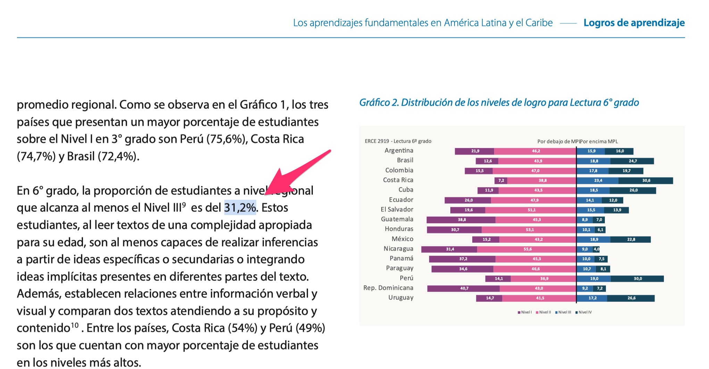

```{r setup, include=FALSE}
#----------------------------------------------------------
# setup
#----------------------------------------------------------


# knitr option
knitr::opts_chunk$set(dev = 'png')
options(knitr.kable.NA = '', digits = 2)
options(scipen = 999999)

# remove all previous objects
rm(list = ls())

# fonts
Sys.setenv(LANG="en_US.UTF-8")


# ------------------------------------------------------
# get times
# ------------------------------------------------------

start_time <- Sys.time()


```

# Introduction

- Is common, in the communication of results of large scale assessment studies, to produce regional or pooled estimates. That is, number figures that represent all participant countries as a whole.

- However, sampling design variables contained in the most of large scale assessment studies are built to generalizable results for each country, and not to generates results for the region as a whole.

- As such, when we need to produce regional figure, we need to adapt the design variables of the sampling design to our purposes. This includes:
  - creating clustering variables
    - adapting stratification variables
  - scaling survey weights, so all countries contribute equally to estimates.

# Example Pooled estimate 

- In the executive report the pooled estimate of students reaching the minimum reading profficiency is of 31.2%, at sixth grade.

```{r echo = FALSE, out.width = '100%', fig.retina = 1}

```

# Code structure

- The following code is a sequence of codes design to produce the pooled estimates. Is executed in steps, as a reproducible sequence. Code sections are:

  - Libraries in use
  - Load data
  - Clustering variables
  - Recode profficiency level variables
  - Declaring Sampling Survey Design
  - Estimate results with plausible values
  - Edit table
  - Export results

The present code is a way to the produce the pooled estimates, and reproduce the published results.


## Libraries in use

```{r echo = TRUE, eval = FALSE}

# -------------------------------------------------------------------
# libraries use in the following code
# -------------------------------------------------------------------

#------------------------------------------------
# libraries
#------------------------------------------------

# collection of libraries to handle data
install.packages('tidyverse')

# library to install libraries from github
install.packages('devtools')

# library with ERCE 2019 data
devtools::install_github('dacarras/erce',force = TRUE)

# library to generate survey estimates
install.packages('survey')

# library to generate survey estimates
install.packages('srvyr')

# library to get estimates with plausible values
install.packages('mitools')

# library to save tables into excel
install.packages('openxlsx')

# library to fit multilevel models
install.packages('WeMix')

```


## Load data

```{r echo = TRUE, eval = TRUE}

# -------------------------------------------------------------------
# minimal reading profficiency
# -------------------------------------------------------------------

#------------------------------------------------
# load data
#------------------------------------------------

library(dplyr)
data_raw <- erce::erce_2019_qa6

```


## Clustering variables

```{r echo = TRUE, eval = TRUE}

# -------------------------------------------------------------------
# minimal reading profficiency
# -------------------------------------------------------------------

#------------------------------------------------
# load data
#------------------------------------------------

#------------------------------------------------
# clustering variables
#------------------------------------------------

data_clu <- data_raw %>%
erce::remove_labels() %>% #<<
mutate(id_s = as.numeric(as.factor(paste0(IDCNTRY, "_", STRATA)))) %>%
mutate(id_j = as.numeric(as.factor(paste0(IDCNTRY, "_", IDSCHOOL)))) %>%
mutate(id_i = seq(1:nrow(.)))

```

## Recode profficiency level variables

```{r echo = TRUE, eval = TRUE}

# -------------------------------------------------------------------
# minimal reading profficiency
# -------------------------------------------------------------------

#------------------------------------------------
# recoding profficiency levels
#------------------------------------------------

data_rec <- data_clu %>%
mutate(lan_min_1 = case_when(
LAN_L1 == 'I'   ~ 0,
LAN_L1 == 'II'  ~ 0,
LAN_L1 == 'III' ~ 1,
LAN_L1 == 'IV'  ~ 1)) %>%
mutate(lan_min_2 = case_when(
LAN_L2 == 'I'   ~ 0,
LAN_L2 == 'II'  ~ 0,
LAN_L2 == 'III' ~ 1,
LAN_L2 == 'IV'  ~ 1)) %>%
mutate(lan_min_3 = case_when(
LAN_L3 == 'I'   ~ 0,
LAN_L3 == 'II'  ~ 0,
LAN_L3 == 'III' ~ 1,
LAN_L3 == 'IV'  ~ 1)) %>%
mutate(lan_min_4 = case_when(
LAN_L4 == 'I'   ~ 0,
LAN_L4 == 'II'  ~ 0,
LAN_L4 == 'III' ~ 1,
LAN_L4 == 'IV'  ~ 1)) %>%
mutate(lan_min_5 = case_when(
LAN_L5 == 'I'   ~ 0,
LAN_L5 == 'II'  ~ 0,
LAN_L5 == 'III' ~ 1,
LAN_L5 == 'IV'  ~ 1))

```

## Declaring Sampling Survey Design

```{r echo = TRUE, eval = TRUE}

# -------------------------------------------------------------------
# minimal reading profficiency
# -------------------------------------------------------------------

#------------------------------------------------
# data with survey object
#------------------------------------------------

# survey method: taylor series linearization
data_tsl  <- survey::svydesign(
             data    = data_rec, 
             weights = ~WS,       
             strata  = ~id_s,
             id = ~id_j,
             nest = TRUE)

# Note: we correct that strata with a single cluster.

library(survey)
options(survey.lonely.psu="adjust")

```


## Estimate results with plausible values

```{r echo = TRUE, eval = TRUE}

# -------------------------------------------------------------------
# minimal reading profficiency
# -------------------------------------------------------------------

#------------------------------------------------
# percentages with plausible values
#------------------------------------------------

results <- mitools::withPV(
   mapping = lan_min ~ lan_min_1 + lan_min_2 + lan_min_3 + lan_min_4 + lan_min_5,
   data = data_tsl,
   action = quote(
    survey::svymean( ~lan_min, design = data_tsl)
    ),
   rewrite = TRUE
  )


#------------------------------------------------
# display results
#------------------------------------------------

summary(mitools::MIcombine(results))


```

## Edit table

```{r echo = TRUE, eval = TRUE}

# -------------------------------------------------------------------
# minimal reading profficiency
# -------------------------------------------------------------------

#------------------------------------------------
# save estimates
#------------------------------------------------

estimates <- summary(mitools::MIcombine(results))

#------------------------------------------------
# edit table of results
#------------------------------------------------


table_read <- estimates %>%
               tibble::rownames_to_column("lan_min") %>%
               rename(
                lan = results, 
                lan_se = se,
                ll = 4,
                ul = 5,
                miss = 6
                ) %>%
               mutate(lan = lan*100) %>%
               mutate(lan_se = lan_se*100) %>%
               mutate(ll = ll*100) %>%
               mutate(ul = ul*100)

# -----------------------------------------------
# display table
# -----------------------------------------------

options(digits=10)
options(scipen = 999999)

knitr::kable(table_read, digits = 1)

```

## Export results

```{r echo = TRUE, eval = TRUE}

# -------------------------------------------------------------------
# minimal reading profficiency
# -------------------------------------------------------------------

#------------------------------------------------
# export results
#------------------------------------------------

table_read %>%
openxlsx::write.xlsx(., 
  'table_minimum_reading_profficiency_6th_graders.xlsx',
  overwrite = TRUE)


```
